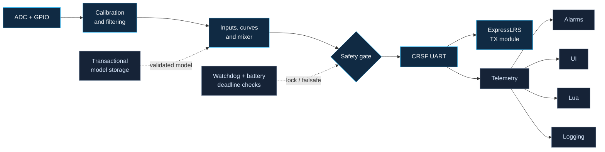

<p align="center">
  
</p>

<p align="center">
  <a href="https://github.com/Twotoz/RivetTX/actions/workflows/host-tests.yml"></a>
  <a href="https://github.com/Twotoz/RivetTX/blob/main/LICENSE"></a>
  
  
  
  
</p>

<p align="center">
  <strong>A compact, safety-oriented RC transmitter firmware for ESP32-C3, ESP32-S3, and ExpressLRS.</strong>
</p>

<p align="center">
  <a href="#why-rivettx">Why RivetTX</a> ·
  <a href="#architecture">Architecture</a> ·
  <a href="#quick-start">Quick start</a> ·
  <a href="#hardware">Hardware</a> ·
  <a href="#documentation">Documentation</a>
</p>

> [!CAUTION]
> RivetTX is an engineering preview, not flight-proven transmitter firmware.
> Keep propellers removed and mechanisms made safe until your exact hardware
> has passed electrical, latency, brownout, failsafe, and hardware-in-the-loop
> validation.

## Why RivetTX

EdgeTX is extraordinarily capable because it supports years of radios,
protocols, displays, and workflows. RivetTX explores a different point in the
design space: one modern MCU family, one native radio link, strict subsystem
boundaries, and a codebase small enough to audit.

RivetTX is **not a fork of EdgeTX**. Its familiar model concepts and
CRSF-facing Lua surface share one implementation across ESP32-C3 and ESP32-S3.

| | |
|---|---|
| **Deterministic control** | Fixed-allocation input, mixer, safety, and CRSF path with deadline and stale-input checks. |
| **ExpressLRS native** | Dynamic module settings, mW power control, bind, Wi-Fi update launch, telemetry, Finder, model ID, failsafe, and recovery. |
| **Safe persistence** | Versioned model schema, CRC validation, copy-on-write saves, read-back verification, and recovery. |
| **Adaptable interface** | Capability-driven layouts for compact, medium, and large displays without screen-specific model logic. |
| **Contained scripting** | Lua 5.5 with safe libraries, a memory ceiling, instruction/time budgets, and bounded CRSF/LCD APIs. |
| **Recoverable platform** | Diagnostic ring, crash snapshot, watchdog, A/B OTA interfaces, rollback, and maintenance backup portal. |

## Architecture

The flight-critical path is deliberately short. UI, Lua, storage, logging,
Wi-Fi, and updates cannot block channel generation.



The control task never allocates memory, accesses flash, renders UI, runs Lua,
or waits on Wi-Fi. A rejected or unhealthy frame becomes the configured
failsafe frame before it reaches CRSF.

## Feature snapshot

- 8 axes, 16 virtual inputs, 16 output channels, and 64 mix lines
- expo, 9-point curves, add/multiply/replace mixes, delay, and slew
- live trim buttons with repeat/center behavior, GVars, five flight modes,
  logical switches, and three timers
- per-channel reverse, subtrim, limits, and failsafe values
- throttle/switch startup checks, stale-input detection, and deadline lockout
- dedicated CH5-CH8/AUX inputs with safe two-position CH5 arming and optional
  three-position CH6-CH8 switches
- four optional scroll-wheel/pot/slider axes on CH9-CH12 and an optional
  pressable menu encoder
- discovered ExpressLRS packet-rate, model-match, power, dynamic-power,
  switch-mode, telemetry-ratio, bind, and Wi-Fi update controls
- CRC-checked CRSF telemetry for link, battery, and GPS data, including
  active-antenna RSSI and correctly decoded TX power in mW
- built-in ELRS Finder with fresh-data protection, visual meter, and optional
  Geiger-counter buzzer
- prioritized audio alerts for weak/critical link, telemetry loss/recovery,
  TX-battery low/critical, ELRS module loss, safety state, and telemetry alarms
- responsive model, input, mix, output, timer, telemetry, and system screens
- calibration workflow, telemetry alarms, CSV logs, and crash diagnostics
- virtual ELRS hardware scenarios, more than 300 host-side checks, sanitizer
  coverage, and complete ESP32-C3 and ESP32-S3 target builds

For exact limits and validation status, see the
[feature matrix](docs/feature-matrix.md).

## Quick start

### Native simulator and tests

Only GNU Make and a C++17 compiler are required:

```bash
git clone https://github.com/Twotoz/RivetTX.git
cd RivetTX
make test
make
./build/rivettx-sim
```

The simulator runs nominal, packet-loss, corrupt-frame, disconnect/recovery,
stale-input, and missed-deadline scenarios against the real core. It writes a
machine-readable result to `build/sim-report.json` and renders compact,
medium, and large previews:

```text
build/sim-screen.pbm
build/sim-screen-medium.pbm
build/sim-screen-large.pbm
```

Run one focused case or display profile with:

```bash
./build/rivettx-sim --scenario disconnect --display compact
make sanitize
```

See the [simulation guide](docs/simulation.md) for the exact boundary between
software evidence and tests that still require real hardware.

### ESP32-C3 / ESP32-S3 firmware

Install and activate ESP-IDF 5.5.2:

```bash
idf.py set-target esp32c3  # or: idf.py set-target esp32s3
idf.py menuconfig
idf.py build
idf.py flash monitor
```

Every successful CI run provides separate `rivettx-esp32c3-<commit>` and
`rivettx-esp32s3-<commit>` artifacts with a one-file factory image, separate
OTA/application image, exact target, flash arguments, source commit, and
SHA-256 checksums. See the
[firmware bundle guide](docs/firmware-bundle.md) before flashing it.

Configure the real pinout under:

```text
Component config -> RivetTX hardware
```

The development defaults keep irreversible production security provisioning
disabled. Apply `sdkconfig.production.defaults` only after signed update and
recovery procedures have been proven on disposable hardware.

## Hardware

The reference profiles are intentionally focused:

| Component | Role |
|---|---|
| ESP32-C3 or ESP32-S3, 4 MiB flash | control, UI, storage, and platform services |
| ExpressLRS **TX module** or supported RX flashed as TX | RF link over full-duplex 3.3 V CRSF UART |
| four required analog axes | two conventional two-axis gimbals |
| up to four extra analog axes | scroll wheels, pots, or sliders on CH9-CH12 |
| four maintained switches | two-position ARM/AUX1; AUX2-AUX4 may be two- or three-position |
| eight optional trim contacts | negative/positive trim for AIL, ELE, THR, and RUD |
| SSD1306 128×64 OLED | first physical display backend |
| four buttons | UP, DOWN, ENTER, and BACK/recovery |
| optional pressable rotary encoder | menu navigation and field editing |
| suitable regulator | must tolerate the chosen TX module's peak current |

An ExpressLRS receiver running normal RX firmware is not a transmitter. A
supported ESP8285/ESP32 receiver may be used after it has been flashed with
ExpressLRS RX-as-TX firmware and its board-specific hardware configuration has
been restored. Do not power a 100 mW or other amplified module from a
development board's 3.3 V pin. See the
[hardware and bring-up guide](docs/hardware.md) before wiring anything.

## Controls

- Hold **UP + DOWN** during boot to enter stick calibration.
- Use **BACK** to cycle screens.
- Use **UP/DOWN** to select fields and **ENTER** to edit.
- While editing, **UP/DOWN** changes the value.
- Hold **ENTER + BACK** for one second to enable outputs or lock them.
- Hold **BACK** during boot to start the recovery portal.

Model edits are staged, saved while locked, and activated on the next boot.

## Documentation

| Document | Contents |
|---|---|
| [Architecture](docs/architecture.md) | safety invariants, task separation, storage, OTA, and Lua boundaries |
| [Feature matrix](docs/feature-matrix.md) | implemented behavior versus hardware validation still required |
| [Simulation](docs/simulation.md) | virtual ELRS scenarios, fault injection, outputs, and validation limits |
| [Hardware guide](docs/hardware.md) | minimum electronics, default GPIOs, controls, and bring-up sequence |
| [ExpressLRS guide](docs/expresslrs.md) | mW settings, bind, Finder, Betaflight OSD telemetry, and TX-module Wi-Fi updates |
| [Betaflight setup](docs/betaflight.md) | AETR/CH5-CH8 mapping, ELRS configuration, FC setup, and mandatory bench tests |
| [Audio alerts](docs/audio-alerts.md) | prioritized buzzer patterns, link thresholds, TX-battery warnings, and configuration |
| [Firmware bundle](docs/firmware-bundle.md) | CI artifact contents, checksum verification, and one-file flashing |

## Project status

RivetTX currently provides an implemented firmware foundation, native
simulator, safety-oriented tests, and reproducible ESP32-C3 and ESP32-S3
builds with ESP-IDF 5.5.2. The platform layer, Lua runtime, bootloader, and A/B
images compile and link in CI. Validation on a specific PCB, display, power
system, and ExpressLRS module is still required.

The name **RivetTX** is a working project name, not a trademark clearance.

## Contributing

Issues, design reviews, hardware measurements, and narrowly scoped pull
requests are welcome. Safety-critical changes should include tests and explain
their timing, failure mode, and recovery behavior.

## License

RivetTX is released under the [MIT License](LICENSE).

---

<p align="center">
  <sub>Built for experimentation, auditability, and careful hardware validation.</sub>
</p>
