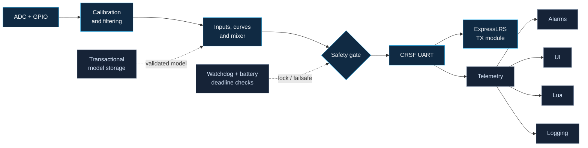

<p align="center">
  
</p>

<p align="center">
  <a href="https://github.com/Twotoz/RivetTX/actions/workflows/host-tests.yml"></a>
  <a href="https://github.com/Twotoz/RivetTX/blob/main/LICENSE"></a>
  
  
  
  
</p>

<p align="center">
  <strong>A compact, safety-oriented RC transmitter firmware for ESP32-C3 and ExpressLRS.</strong>
</p>

<p align="center">
  <a href="#why-rivettx">Why RivetTX</a> ·
  <a href="#architecture">Architecture</a> ·
  <a href="#quick-start">Quick start</a> ·
  <a href="#hardware">Hardware</a> ·
  <a href="#documentation">Documentation</a>
</p>

> [!CAUTION]
> RivetTX is an engineering preview, not flight-proven transmitter firmware.
> Keep propellers removed and mechanisms made safe until your exact hardware
> has passed electrical, latency, brownout, failsafe, and hardware-in-the-loop
> validation.

## Why RivetTX

EdgeTX is extraordinarily capable because it supports years of radios,
protocols, displays, and workflows. RivetTX explores a different point in the
design space: one modern MCU family, one native radio link, strict subsystem
boundaries, and a codebase small enough to audit.

RivetTX is **not a fork of EdgeTX**. Its familiar model concepts and
CRSF-facing Lua surface are implemented specifically for ESP32-C3.

| | |
|---|---|
| **Deterministic control** | Fixed-allocation input, mixer, safety, and CRSF path with deadline and stale-input checks. |
| **ExpressLRS native** | CRSF channels, telemetry, model ID, bind, failsafe, module recovery, and pass-through services. |
| **Safe persistence** | Versioned model schema, CRC validation, copy-on-write saves, read-back verification, and recovery. |
| **Adaptable interface** | Capability-driven layouts for compact, medium, and large displays without screen-specific model logic. |
| **Contained scripting** | Lua 5.5 with safe libraries, a memory ceiling, instruction/time budgets, and bounded CRSF/LCD APIs. |
| **Recoverable platform** | Diagnostic ring, crash snapshot, watchdog, A/B OTA interfaces, rollback, and maintenance backup portal. |

## Architecture

The flight-critical path is deliberately short. UI, Lua, storage, logging,
Wi-Fi, and updates cannot block channel generation.



The control task never allocates memory, accesses flash, renders UI, runs Lua,
or waits on Wi-Fi. A rejected or unhealthy frame becomes the configured
failsafe frame before it reaches CRSF.

## Feature snapshot

- 8 axes, 16 virtual inputs, 16 output channels, and 64 mix lines
- expo, 9-point curves, add/multiply/replace mixes, delay, and slew
- trims, GVars, five flight modes, logical switches, and three timers
- per-channel reverse, subtrim, limits, and failsafe values
- throttle/switch startup checks, stale-input detection, and deadline lockout
- CRC-checked CRSF telemetry for link, battery, and GPS data
- responsive model, input, mix, output, timer, telemetry, and system screens
- calibration workflow, telemetry alarms, CSV logs, and crash diagnostics
- native simulator, 106 host-side checks, and a complete ESP32-C3 target build

For exact limits and validation status, see the
[feature matrix](docs/feature-matrix.md).

## Quick start

### Native simulator and tests

Only GNU Make and a C++17 compiler are required:

```bash
git clone https://github.com/Twotoz/RivetTX.git
cd RivetTX
make test
make
./build/rivettx-sim
```

The simulator writes a monochrome preview to `build/sim-screen.pbm`.

### ESP32-C3 firmware

Install and activate ESP-IDF 5.5.2:

```bash
idf.py set-target esp32c3
idf.py menuconfig
idf.py build
idf.py flash monitor
```

Configure the real pinout under:

```text
Component config -> RivetTX hardware
```

The development defaults keep irreversible production security provisioning
disabled. Apply `sdkconfig.production.defaults` only after signed update and
recovery procedures have been proven on disposable hardware.

## Hardware

The first reference profile is intentionally focused:

| Component | Role |
|---|---|
| ESP32-C3, 4 MiB flash | control, UI, storage, and platform services |
| ExpressLRS **TX module** | RF link over full-duplex 3.3 V CRSF UART |
| four analog axes | two conventional two-axis gimbals |
| SSD1306 128×64 OLED | first physical display backend |
| four buttons | UP, DOWN, ENTER, and BACK/recovery |
| suitable regulator | must tolerate the chosen TX module's peak current |

An ExpressLRS receiver is not a substitute for the TX module. Do not power a
high-power external module from a development board's 3.3 V pin. See the
[hardware and bring-up guide](docs/hardware.md) before wiring anything.

## Controls

- Hold **UP + DOWN** during boot to enter stick calibration.
- Use **BACK** to cycle screens.
- Use **UP/DOWN** to select fields and **ENTER** to edit.
- While editing, **UP/DOWN** changes the value.
- Hold **ENTER + BACK** for one second to enable outputs or lock them.
- Hold **BACK** during boot to start the recovery portal.

Model edits are staged, saved while locked, and activated on the next boot.

## Documentation

| Document | Contents |
|---|---|
| [Architecture](docs/architecture.md) | safety invariants, task separation, storage, OTA, and Lua boundaries |
| [Feature matrix](docs/feature-matrix.md) | implemented behavior versus hardware validation still required |
| [Hardware guide](docs/hardware.md) | minimum electronics, default GPIOs, controls, and bring-up sequence |

## Project status

RivetTX currently provides an implemented firmware foundation, native
simulator, safety-oriented tests, and a reproducible ESP32-C3 build with
ESP-IDF 5.5.2. The platform layer, Lua runtime, bootloader, and A/B image now
compile and link in CI. Validation on a specific PCB, display, power system,
and ExpressLRS module is still required.

The name **RivetTX** is a working project name, not a trademark clearance.

## Contributing

Issues, design reviews, hardware measurements, and narrowly scoped pull
requests are welcome. Safety-critical changes should include tests and explain
their timing, failure mode, and recovery behavior.

## License

RivetTX is released under the [MIT License](LICENSE).

---

<p align="center">
  <sub>Built for experimentation, auditability, and careful hardware validation.</sub>
</p>
